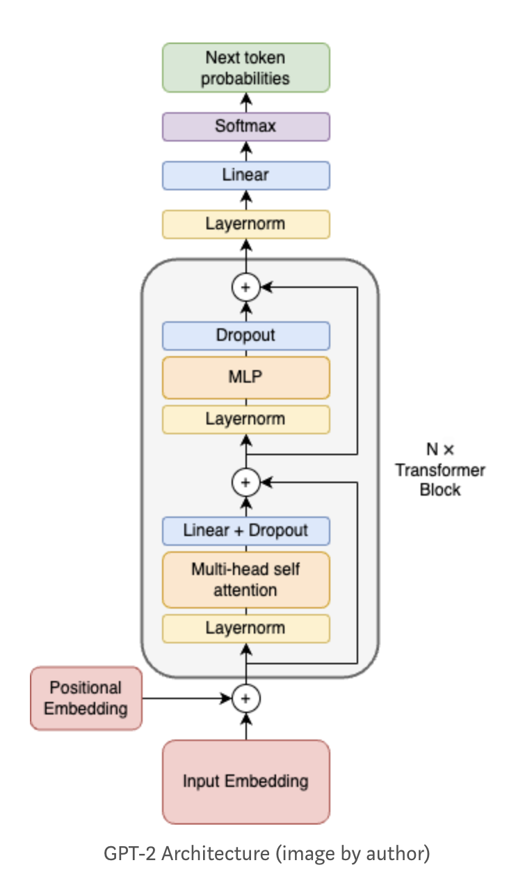
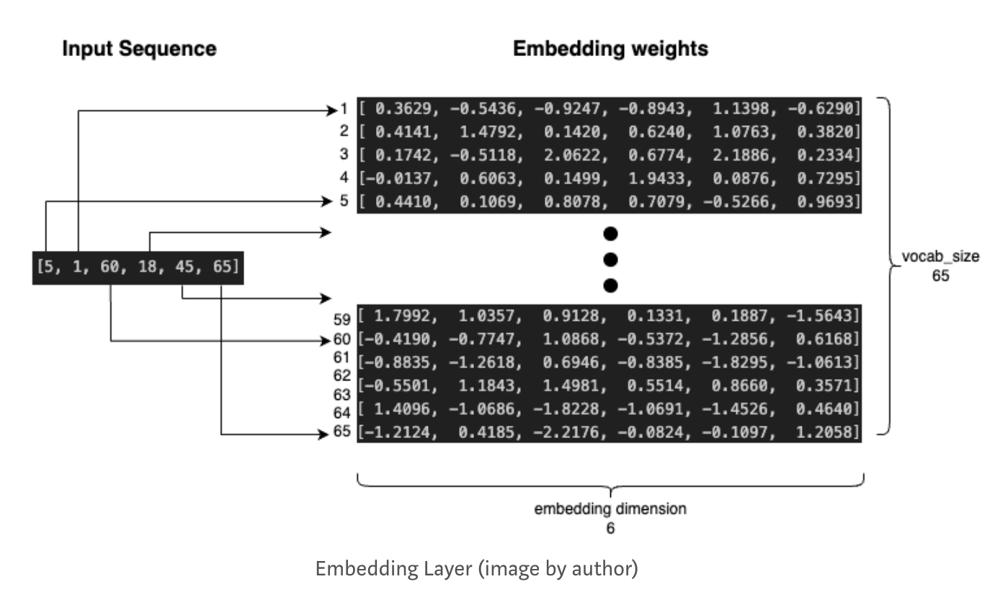
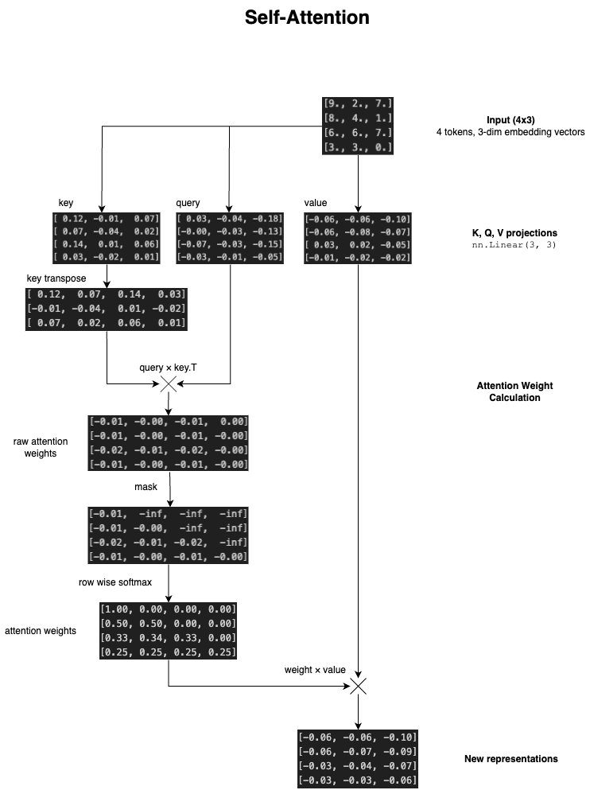
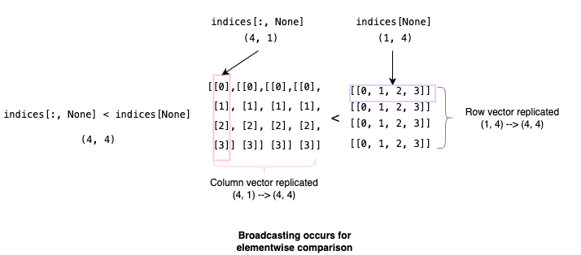
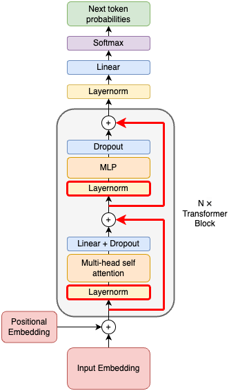

# GPT-2 From scratch in mlx
Train.py is ~200 lines of python code that define and train GPT-2 from scratch using mlx and numpy as the only dependencies. This readme will detail writing train.py from scratch. The model is trained on ~1 million characters of Shakespeare contained in input.txt, and it can be trained in around 10 minutes on a macbook to produce coherent Shakespeare-like text.

## Table of Contents
  - [Preparing the data](#preparing-thedata)
  - [Creating the vocabulary](#creating-the-vocabulary)
  - [Coding GPT-2](#coding-gpt-2)
    - [Input Embeddings](#input-embeddings)
  - [Positional Embeddings](#positional-embeddings)
  - [Self-Attention](#self-attention)
    - [Keys, Queries, and Values](#keys-queries-andvalues)
  - [Multi-Head Attention](#multi-head-attention)
  - [MLP](#mlp)
  - [Block](#block)
  - [Layernorms and Skip Connections](#layernorms-and-skip-connections)
  - [Forward Pass](#forward-pass)
  - [Sampling](#sampling)
  - [Initialization](#initialization)
  - [Training Loop](#training-loop)
  - [References](#references)

## Preparing the data
Install mlx and run the following imports.
```py
import mlx.core as mx
import mlx.nn as nn
import mlx.optimizers as optim
import mlx.utils as utils
import numpy as np
import math
```
The first step to training an LLM is collecting a large corpus of text data and then tokenizing it. Tokenization is the process of mapping text to integers, which can be fed into the LLM. Our training corpus for this model will be the works of Shakespeare concatenated into one file. This is roughly 1 million characters and looks like this:
```
First Citizen:
Before we proceed any further, hear me speak.

All:
Speak, speak.

First Citizen:
You are all resolved rather to die than to famish?

All:
Resolved. resolved.

First Citizen:
First, you know Caius Marcius is chief enemy to the people.
...
```
First, we read the file as a single long string into the text variable. Then we use the set() function to get all the unique characters in the text which will be our vocabulary. By printing vocab you can see all the characters in our vocabulary as one string, and we have a total of 65 characters which till be our tokens.
## Creating the vocabulary
```py
with open('input.txt', 'r', encoding='utf-8') as f:
    text = f.read()
vocab = sorted(list(set(text)))
vocab_size = len(vocab)

print(''.join(vocab))
# !$&',-.3:;?ABCDEFGHIJKLMNOPQRSTUVWXYZabcdefghijklmnopqrstuvwxyz
print(vocab_size)
# 65
```
Production models will use tokenization algorithms like byte-pair encoding to generate a larger vocabulary of sub-word chunks. Since our focus today is on the architecture, we will continue with character-level tokenization. Next, we will map our vocabulary to integers known as token IDs. Then we can encode our text into tokens and decode them back to a string.
``` py
# Create mapping from vocab to integers
itos = {i:c for i,c in enumerate(vocab)} # int to string
stoi = {c:i for i,c in enumerate(vocab)} # string to int
encode = lambda x: [stoi[c] for c in x]
decode = lambda x: ''.join([itos[i] for i in x])

print(encode("hello world"))
# [46, 43, 50, 50, 53, 1, 61, 53, 56, 50, 42]
print(decode(encode("hello world")))
# hello world
```
We use the `enumerate()` function to iterate over all characters and their index in the vocabulary and create a dictionary itos which maps integers to characters and stoi which maps strings to integers. Then we use these mappings to create our encode and decode functions. Now we can encode the entire text and split training and validation data.
```py
data = encode(text)
split = int(0.9 * len(data))
train_data = data[:split]
val_data = data[split:]
```
Currently, our training data is just a very long string of tokens. However, we are trying to train our model to predict the next token some given previous tokens. Therefore our dataset should be comprised of examples where the input is some string of tokens and the label is the correct next token. We need to define a model parameter called context length which is the maximum number of tokens used to predict the next token. Our training examples will be the length of our context length.
Let's look at the first ctx_len+1 tokens.
```py
ctx_len = 8
print(train_data[:ctx_len + 1])
# [18, 47, 56, 57, 58,  1, 15, 47, 58]
# x: [18, 47, 56, 57, 58,  1, 15, 47] | y: 58
```
This is one training example where the input is "18, 47, 56, 57, 58, 1, 15, 47" and the desired output is "58". This is 8 tokens of context. However, we also want to train the model to predict the next token given only 7, 6, 5 … 0 tokens as context which is needed during generation. Therefore we also consider the 8 sub examples packed into this example:
```py
ctx_len = 8
print(train_data[:ctx_len + 1])
# [18, 47, 56, 57, 58,  1, 15, 47, 58]
# 8 sub examples
# [18] --> 47
# [18, 47] --> 56
# [18, 47, 56] --> 57
# [18, 47, 56, 57] --> 58
# [18, 47, 56, 57, 58] --> 1
# [18, 47, 56, 57, 58, 1] --> 15
# [18, 47, 56, 57, 58, 1, 15] --> 47
# [18, 47, 56, 57, 58, 1, 15, 47] --> 58
```
Notice that the labels are simply the inputs shifted left.
```py
print("inputs: ", train_data[:ctx_len])
print("labels: ", train_data[1:ctx_len+1]) # labels = inputs indexed 1 higher
# inputs: [18, 47, 56, 57, 58,  1, 15, 47]
# labels: [47, 56, 57, 58,  1, 15, 47, 58]
```
At index 0 the input is 18 and the label is 47. At index 1 the input is everything before and including index 1 which is [18, 47] and the label is 56, etc. Now that we understand that the labels are simply the input sequence indexed one higher we can build our datasets.
```py
# Creating training and validation datasets
ctx_len = 8
X_train = mx.array([train_data[i:i+ctx_len] for i in range(0, len(train_data) - ctx_len, ctx_len)])
y_train = mx.array([train_data[i+1:i+ctx_len+1] for i in range(0, len(train_data) - ctx_len, ctx_len)])
X_val = mx.array([val_data[i:i+ctx_len] for i in range(0, len(val_data) - ctx_len, ctx_len)])
y_val = mx.array([val_data[i+1:i+ctx_len+1] for i in range(0, len(val_data) - ctx_len, ctx_len)])
```
We loop through the data and take chunks of size `ctx_len` as the inputs (X) and then take the same chunks but at 1 higher index as the labels (y). Then we take these Python lists and create mlx array objects from them. The model internals will be written with mlx so we want our inputs to be mlx arrays.

One more thing. During training we don't want to feed the model one example at a time, we want to feed it multiple examples in parallel for efficiency. This group of examples is called our batch, and the number of examples in a group is our batch size. Thus we define a function to generate batches for training.
```py
def get_batches(X, y, b_size, shuffle=True):
    if shuffle:
        ix = np.arange(X.shape[0])
        np.random.shuffle(ix)
        ix = mx.array(ix)
        X = X[ix]
        y = y[ix]
    for i in range(0, X.shape[0], b_size):
        input = X[i:i+b_size]
        label = y[i:i+b_size]
        yield input, label
```
If shuffle=True, we shuffle the data by indexing it with a randomly shuffled index. Then we loop through our dataset and return batch-size chunks from input and label datasets. These chunks are known as mini-batches and are just stacked examples that we process in parallel. These mini-batches will be our input to the model during training.

Here's an example of a minibatch of 4 examples with context length 8.

This minibatch packs 32 next-token prediction problems. The model will predict the next token for each token in the input and the labels will be used to calculate the loss. Notice that the labels contain the next token for each index of the inputs.

You'll want to keep this picture in your mind because the shapes of these tensors will get hairy. For now, just remember that we will input a tensor of shape (batch_size, ctx_len) to the model.
## Coding GPT-2
Let's look at the GPT-2 architecture to get an overview of what we are trying to implement.

Don't worry if this looks confusing. We will implement it step by step from bottom to top. Let's start by implementing the input embeddings.
### Input Embeddings
The purpose of the input embedding layer is to map token IDs to vectors. Each token will be mapped to a vector which will be its representation as it is forwarded through the model. The vectors for each token will accumulate and exchange information as they pass through the model and eventually be used to predict the next token. These vectors are called embeddings.

The simplest way to map token IDs to vectors is through a lookup table. We create a matrix of size (vocab_size, n_emb) where each row is the embedding vector for the corresponding token. This matrix is known as the embedding weights.



The diagram shows an example embedding layer of size (65, 6). This means there are 65 tokens in the vocabulary and each one will be represented by a length 6 embedding vector. The inputted sequence will be used to index the embedding weights to get the vector corresponding to each token. Remember the minibatches we input into the model? Originally the minibatch is size (batch_size, ctx_len). After passing through the embedding layer it is size (batch_size, ctx_len, n_emb). Instead of each token being a single integer, each token is now a vector of length n_emb.

Let's define the embedding layer in code now.
```py
n_emb = 6 # You can add these hyperparams at the top of your file
class GPT(nn.Module):
    def __init__(self):
        super().__init__()
        self.wte = nn.Embedding(vocab_size, n_emb)
```
We will define a class to organize our implementation. We subclass nn.Module to take advantage of mlx's features. Then in the init function, we call the superclass constructor and initialize our token embedding layer called `wte`.
## Positional Embeddings
Next up is the positional embeddings. The purpose of positional embeddings is to encode information about the position of each token in the sequence. This can be added to our input embeddings to get a complete representation of each token that contains information about the token's position in the sequence.
```py
class GPT(nn.Module):
    def __init__(self):
        super().__init__()
        self.wte = nn.Embedding(vocab_size, n_emb) # token embeddings
        self.wpe = nn.Embedding(ctx_len, n_emb) # position embeddings
```
The position embeddings work the same as token embeddings, except instead of having a row for each token we have a row for each possible position index. This means our embedding weights will be of shape (ctx_len, n_emb). Now we implement the __call__ function in our GPT class. This function will contain the forward pass of the model.
```py
# Tensor shapes commented
def __call__(self, x):
    B, T = x.shape # (B = batch_size, T = ctx_len)
    tok_emb = self.wte(x) # (B, T, n_emb)
    pos_emb = self.wpe(mx.arange(T)) # (T, n_emb)
    x = tok_emb + pos_emb # (B, T, n_emb)
```
First, we break out the dimensions of our input into variables B and T for easy handling. In sequence modeling contexts B and T are usually used as shorthand for "batch" and "time" dimensions. In this case, the "time" dimension of our sequence is the context length.

Next, we calculate token and position embeddings. Notice that for the position embeddings, our input is `mx.arange(T)`. This will output an array of consecutive integers from 0 to T-1 which is exactly what we want because those are the positions we want to embed. After passing that through the embedding layer we will have a tensor of shape (T, n_emb) because the embedding layer plucks out the n_emb length vector for each of the T positions. Note that even though pos_emb is not the same shape as tok_emb we can add the two because mlx will broadcast, or replicate pos_emb across the batch dimension to allow elementwise addition. Finally, we perform the addition to get the new representations of the tokens with positional information.
## Self-Attention
So far the representation vectors for each token have been calculated independently. They have not had the opportunity to exchange any information. This is intuitively bad in language modeling because the meaning and usage of words depend on the surrounding context. Self-attention is how we incorporate information from previous tokens into a given token.
First, let's consider a naive approach. What if we simply represented each token as the average of its representation vector and the vectors of all the tokens before it? This achieves our goal of packing information from previous tokens into the representation for a given token. Here's what it would look like.


But self-attention doesn't involve writing a for-loop. The key insight is we can achieve this previous token averaging with matrix multiplication!


By multiplying our input sequence on the left by a special matrix we get the desired result. This matrix is known as the attention weights. Notice that each row of the attention weight matrix specificies "how much" of each other token goes into the representation for any given token. For example in row two, we have [0.5, 0.5, 0, 0]. This means that row two of the result will be `0.5*token1 + 0.5*token2 + 0*token3 + 0*token4`, or the average of token1 and token2. Note that the attention weights are a lower-triangular matrix (zeros in upper right entries). This ensures that future tokens will not be included in the representation of a given token. This ensures that tokens can only communicate with the previous tokens because during generation the model will only have access to previous tokens.

Let's look at how we can construct the attention weight matrix.


Notice that if we create an array of zeros with -inf in the upper right entries and then perform row-wise softmax we get the desired attention weights. A good exercise is to step through the softmax calculation for a row to see how this works. The takeaway is that we can take some array of size (ctx_len, ctx_len) and softmax each row to get attention weights that sum to one.

Now we can leave the realm of naive self-attention. Instead of simply averaging previous tokens, we use arbitrary weighted sums over previous tokens. Notice what happens when we do row-wise softmax of an arbitrary matrix.


We still get weights that sum to one on each row. During training, we can learn the numbers in the matrix on the left which will specify how much each token goes into the representation for another token. This is how tokens pay "attention" to each other. But we still haven't understood where this matrix on the left came from. These pre-softmax attention weights are calculated from the tokens themselves, but indirectly through three linear projections.

### Keys, Queries, and Values



Each token in our sequence emits 3 new vectors. These vectors are called keys, queries, and values. We use the dot product of the query vector of one token and the key vector of another token to quantify the "affinity" those two tokens have. We want to calculate the pairwise affinities of each token with every other token, therefore we multiply the query vector (4x3) with the key vector transposed (3x4) to get the raw attention weights (4x4). Due to the way matrix multiplication works the (i,j) entry in the raw attention weights will be the query of token i dot the key of token j or the "affinity" between the two. Thus we have calculated interactions between every token. However, we don't want past tokens interacting with future tokens so we apply a mask of -inf to the upper right entries to ensure they will zero out after softmax. Then we perform row-wise softmax to get the final attention weights. Instead of multiplying these weights directly with the input, we multiply them with the value projection. This results in the new representations.

Now that we understand attention conceptually, let's implement it.
```py
class Attention(nn.Module):
    def __init__(self, head_size):
        super().__init__()
        self.head_size = head_size
        self.k_proj = nn.Linear(n_emb, head_size, bias=False)
        self.q_proj = nn.Linear(n_emb, head_size, bias=False)
        self.v_proj = nn.Linear(n_emb, head_size, bias=False)
```
We start by defining the key, query, and value projection layers. Note that instead of going from n_emb to n_emb, we project from n_emb to head_size. This doesn't change anything, it just means the new representations calculated by attention will be dimension head_size.
```py
class Attention(nn.Module):
    def __init__(self, head_size):
        super().__init__()
        self.head_size = head_size
        self.k_proj = nn.Linear(n_emb, head_size, bias=False)
        self.q_proj = nn.Linear(n_emb, head_size, bias=False)
        self.v_proj = nn.Linear(n_emb, head_size, bias=False)
    def __call__(self, x): # shapes commented
        B, T, C = x.shape # (batch_size, ctx_len, n_emb)
        K = self.k_proj(x) # (B, T, head_size)
        Q = self.q_proj(x) # (B, T, head_size)
        V = self.v_proj(x) # (B, T, head_size)
```
The forward pass begins by calculating the key, query, and value projections. We also break out the input shape into the variables B, T, and C for future convenience.
```py
class Attention(nn.Module):
    def __init__(self, head_size):
        super().__init__()
        self.head_size = head_size
        self.k_proj = nn.Linear(n_emb, head_size, bias=False)
        self.q_proj = nn.Linear(n_emb, head_size, bias=False)
        self.v_proj = nn.Linear(n_emb, head_size, bias=False)
    def __call__(self, x):
        B, T, C = x.shape # (batch_size, ctx_len, n_emb)
        K = self.k_proj(x) # (B, T, head_size)
        Q = self.q_proj(x) # (B, T, head_size)
        V = self.v_proj(x) # (B, T, head_size)
        attn_weights = (Q @ K.transpose([0, 2, 1])) / math.sqrt(self.head_size)
        # attn_weights.shape = (B, T, T)
```
Next, we calculate the attention weights. We only want to transpose the last two dimensions of the key tensor, because the batch dimension is just there so we can forward multiple training examples in parallel. The mlx transpose function expects the new order of the dimensions as input, so we pass it [0, 2, 1] to transpose the last two dimensions. One more thing: we scale the attention weights by the inverse square root of head_size. This is known as scaled attention and the purpose is to ensure that when Q and K are unit variance, attn_weights will be unit variance. If the variance of attn_weights is high, then the softmax will map these small and large values to 0 or 1which results in less complex representations.

The next step is to apply the mask to ensure we are doing causal language modeling i.e. ensuring tokens cannot attend to future tokens.
```py
class Attention(nn.Module):
    def __init__(self, head_size):
        super().__init__()
        self.head_size = head_size
        self.k_proj = nn.Linear(n_emb, head_size, bias=False)
        self.q_proj = nn.Linear(n_emb, head_size, bias=False)
        self.v_proj = nn.Linear(n_emb, head_size, bias=False)
        indices = mx.arange(ctx_len)
        mask = indices[:, None] < indices[None] # broadcasting trick
        self._causal_mask = mask * -1e9
    def __call__(self, x):
        B, T, C = x.shape # (batch_size, ctx_len, n_emb)
        K = self.k_proj(x) # (B, T, head_size)
        Q = self.q_proj(x) # (B, T, head_size)
        V = self.v_proj(x) # (B, T, head_size)
        attn_weights = (Q @ K.transpose([0, 2, 1])) / math.sqrt(self.head_size)
        # attn_weights.shape = (B, T, T)
```
We create the mask with a clever broadcasting trick. Let's say our ctx_len=4 like in the diagrams above. First, we use mx.arange(4) to set the indices variable to [0, 1, 2, 3].



Then we can index like so `indices[:, None]` to generate a column vector with the values of indices. Similarly, we can get a row vector using `indices[None]`. Then when we do the < comparison, mlx broadcasts the vectors because they have mismatching shapes so they can't be compared elementwise. Broadcasting means mlx will replicate the vectors along the lacking dimension. This results in an elementwise comparison of two (4, 4) matrices which makes sense. Side note: I recommend familiarizing yourself with the details of broadcasting by reading [this](https://pytorch.org/docs/stable/notes/broadcasting.html), it comes up all the time when dealing with tensors.

After the elementwise comparison, we are left with the following tensor:
```py
[[False,  True,  True,  True],
 [False, False,  True,  True],
 [False, False, False,  True],
 [False, False, False, False]]
```
Multiplying this tensor by -1e9, we get:
```py
[[-0e+00, -1e+09, -1e+09, -1e+09],
 [-0e+00, -0e+00, -1e+09, -1e+09],
 [-0e+00, -0e+00, -0e+00, -1e+09],
 [-0e+00, -0e+00, -0e+00, -0e+00]]
```
Now we have an additive mask. We can add this matrix to our attention weights to make all the upper right entries very large negative numbers. This will cause them to be zeroed out after the softmax operation. Also, note that we add "_" as a prefix to the attribute name _causal_mask which marks it as a private variable. This signals to mlx that it is not a parameter and should not be updated during training.
```py
class Attention(nn.Module):
    def __init__(self, head_size):
        super().__init__()
        self.head_size = head_size
        self.k_proj = nn.Linear(n_emb, head_size, bias=False)
        self.q_proj = nn.Linear(n_emb, head_size, bias=False)
        self.v_proj = nn.Linear(n_emb, head_size, bias=False)
        indices = mx.arange(ctx_len)
        mask = indices[:, None] < indices[None] # broadcasting trick
        self._causal_mask = mask * -1e9
    def __call__(self, x):
        B, T, C = x.shape # (batch_size, ctx_len, n_emb)
        K = self.k_proj(x) # (B, T, head_size)
        Q = self.q_proj(x) # (B, T, head_size)
        V = self.v_proj(x) # (B, T, head_size)
        attn_weights = (Q @ K.transpose([0, 2, 1])) / math.sqrt(self.head_size)
        # attn_weights.shape = (B, T, T)
        attn_weights = attn_weights + self._causal_mask
        attn_weights = mx.softmax(attn_weights, axis=-1)
        o = (attn_weights @ V) # (B, T, head_size)
```
Now we can softmax row-wise to get the final attention weights and multiply these weights by the values to get our output. Note we pass axis=-1 to softmax which specifies that we want to softmax across the last dimension which are the rows.
The final step is output linear projection and dropout.
```py
dropout = 0.1 # add this with hyperparams at top of file
class Attention(nn.Module):
    def __init__(self, head_size):
        super().__init__()
        self.head_size = head_size
        self.k_proj = nn.Linear(n_emb, head_size, bias=False)
        self.q_proj = nn.Linear(n_emb, head_size, bias=False)
        self.v_proj = nn.Linear(n_emb, head_size, bias=False)
        indices = mx.arange(ctx_len)
        mask = indices[:, None] < indices[None] # broadcasting trick
        self._causal_mask = mask * -1e9
        self.c_proj = nn.Linear(head_size, n_emb) # output projection
        self.resid_dropout = nn.Dropout(dropout)
    def __call__(self, x):
        B, T, C = x.shape # (batch_size, ctx_len, n_emb)
        K = self.k_proj(x) # (B, T, head_size)
        Q = self.q_proj(x) # (B, T, head_size)
        V = self.v_proj(x) # (B, T, head_size)
        attn_weights = (Q @ K.transpose([0, 2, 1])) / math.sqrt(self.head_size)
        # attn_weights.shape = (B, T, T)
        attn_weights = attn_weights + self._causal_mask
        attn_weights = mx.softmax(attn_weights, axis=-1)
        o = (attn_weights @ V) # (B, T, head_size)
        o = self.c_proj(self.resid_dropout(o))
        return o
```
We add two new layers, `c_proj` and `resid_dropout` which are the output projection and residual dropout. The output projection is to return the vectors to their original dimension n_emb. The dropout is added for regularization and training stability which is important as we start layering the transformer blocks to get a deep network. And that's it for implementing one attention head! 
## Multi-Head Attention
Instead of having just one attention head LLMs often use multiple attention heads in parallel and concatenate their outputs to create the final representation. For example, let's say we had one attention head with head_size=64 so the vector it produced for each token was 64 dimensional. We could achieve the same thing with 4 parallel attention heads each with head_size=16 by concatenating their outputs to produce a 16x4 = 64 dimensional output. Multi-head attention allows the model to learn more complex representations because each head learns different projections and attention weights.
```py
n_heads = 4
class MultiHeadAttention(nn.Module): # naive implementation
    def __init__(self):
        super().__init__()
        self.heads = [Attention(head_size // n_heads) for _ in range(n_heads)]
    def __call__(self, x):
        return mx.concatenate([head(x) for head in self.heads], axis=-1)
```
The straightforward implementation is to create a list of n_heads attention heads where each one has size equal to our final head size divided by n_heads. Then we concatenate the output of each head over the last axis. However, this implementation is inefficient and does not take advantage of the speed of tensors. Let's implement multi-head attention with the power of tensors.
```py
head_size = 64 # put at top of file
class MultiHeadAttention(nn.Module):
    def __init__(self):
        super().__init__()
        self.k_proj = nn.Linear(n_emb, head_size, bias=False)
        self.q_proj = nn.Linear(n_emb, head_size, bias=False)
        self.v_proj = nn.Linear(n_emb, head_size, bias=False)
        indices = mx.arange(ctx_len)
        mask = indices[:, None] < indices[None] # broadcasting trick
        self._causal_mask = mask * -1e9
        self.c_proj = nn.Linear(head_size, n_emb) # output projection
        self.resid_dropout = nn.Dropout(dropout)
    def __call__(self, x):
        B, T, C = x.shape # (batch_size, ctx_len, n_emb)
        K = self.k_proj(x) # (B, T, head_size)
        Q = self.q_proj(x) # (B, T, head_size)
        V = self.v_proj(x) # (B, T, head_size)
```
We start with our single-head attention implementation. The `__init__()` function has not changed. The forward pass begins as normal with the creation of the key, query, and value projections.
```py
head_size = 64 # put at top of file
n_heads = 8 # put at top of file
class MultiHeadAttention(nn.Module):
    def __init__(self):
        super().__init__()
        self.k_proj = nn.Linear(n_emb, head_size, bias=False)
        self.q_proj = nn.Linear(n_emb, head_size, bias=False)
        self.v_proj = nn.Linear(n_emb, head_size, bias=False)
        indices = mx.arange(ctx_len)
        mask = indices[:, None] < indices[None] # broadcasting trick
        self._causal_mask = mask * -1e9
        self.c_proj = nn.Linear(head_size, n_emb) # output projection
        self.resid_dropout = nn.Dropout(dropout)
    def __call__(self, x):
        B, T, C = x.shape # (batch_size, ctx_len, n_emb)
        K = self.k_proj(x) # (B, T, head_size)
        Q = self.q_proj(x) # (B, T, head_size)
        V = self.v_proj(x) # (B, T, head_size)
        mha_shape = (B, T, n_heads, head_size//n_heads)
        K = mx.as_strided(K, (mha_shape)) # (B, T, n_heads, head_size//n_heads)
        Q = mx.as_strided(Q, (mha_shape)) # (B, T, n_heads, head_size//n_heads)
        V = mx.as_strided(V, (mha_shape)) # (B, T, n_heads, head_size//n_heads)
```
The next thing we need to do is introduce a new dimension for the number of heads `n_heads`. In the naive implementation, we had separate attention objects each with their own key, query, and value tensors but now we have them all in one tensor, therefore we need a dimension for the heads. We define the new shape we want in `mha_shape`. Then we use `mx.as_strided()` to reshape each tensor to have the head dimension. This function is equivalent to `view` from pytorch and tells mlx to treat this array as a different shape. But we still have a problem. Notice that we if try to multiply `Q @ K_t` (where K_t is K transposed over it's last 2 dims) to compute attention weights as we did before, we will be multiplying the following shapes:
```
(B, T, n_heads, head_size//n_heads) @ (B, T, head_size//n_heads, n_heads)
Result shape: (B, T, n_heads, n_heads)
```
This would result in a tensor of shape `(B, T, n_heads, n_heads)` which is incorrect. Remember, with one head our attention weights were shape `(B, T, T)` which makes sense because it gives us the interaction between each pair of tokens. So now our shape should be the same but with a heads dimension: `(B, n_heads, T, T)`. We achieve this by transposing the dimensions of keys, queries, and values after we reshape them to make n_heads dimension 1 instead of 2.
```py
head_size = 64 # put at top of file
n_heads = 8 # put at top of file
class MultiHeadAttention(nn.Module):
    def __init__(self):
        super().__init__()
        self.k_proj = nn.Linear(n_emb, head_size, bias=False)
        self.q_proj = nn.Linear(n_emb, head_size, bias=False)
        self.v_proj = nn.Linear(n_emb, head_size, bias=False)
        indices = mx.arange(ctx_len)
        mask = indices[:, None] < indices[None] # broadcasting trick
        self._causal_mask = mask * -1e9
        self.c_proj = nn.Linear(head_size, n_emb) # output projection
        self.attn_dropout = nn.Dropout(dropout)
        self.resid_dropout = nn.Dropout(dropout)
    def __call__(self, x):
        B, T, C = x.shape # (batch_size, ctx_len, n_emb)
        K = self.k_proj(x) # (B, T, head_size)
        Q = self.q_proj(x) # (B, T, head_size)
        V = self.v_proj(x) # (B, T, head_size)
        mha_shape = (B, T, n_heads, head_size//n_heads)
        K = mx.as_strided(K, (mha_shape)).transpose([0, 2, 1, 3]) # (B, n_heads, T, head_size//n_heads)
        Q = mx.as_strided(Q, (mha_shape)).transpose([0, 2, 1, 3]) # (B, n_heads, T, head_size//n_heads)
        V = mx.as_strided(V, (mha_shape)).transpose([0, 2, 1, 3]) # (B, n_heads, T, head_size//n_heads)
        attn_weights = (Q @ K.transpose([0, 1, 3, 2])) / math.sqrt(Q.shape[-1]) # (B, n_heads, T, T)
        attn_weights = attn_weights + self._causal_mask[:T, :T]
        attn_weights = mx.softmax(attn_weights, axis=-1)
        attn_weights = self.attn_dropout(attn_weights)
        o = (attn_weights @ V) # (B, n_heads, T, head_size//n_heads)
```
Now we can calculate the correction attention weights. Notice that we scale the attention weights by the size of an individual attention head rather than head_size which would be the size after concatenation. We also apply dropout to the attention weights.

Finally, we perform the concatenation and apply the output projection and dropout.
```py
head_size = 64 # put at top of file
n_heads = 8 # put at top of file
class MultiHeadAttention(nn.Module):
    def __init__(self):
        super().__init__()
        self.k_proj = nn.Linear(n_emb, head_size, bias=False)
        self.q_proj = nn.Linear(n_emb, head_size, bias=False)
        self.v_proj = nn.Linear(n_emb, head_size, bias=False)
        indices = mx.arange(ctx_len)
        mask = indices[:, None] < indices[None] # broadcasting trick
        self._causal_mask = mask * -1e9
        self.c_proj = nn.Linear(head_size, n_emb) # output projection
        self.attn_dropout = nn.Dropout(dropout)
        self.resid_dropout = nn.Dropout(dropout)
    def __call__(self, x):
        B, T, C = x.shape # (batch_size, ctx_len, n_emb)
        K = self.k_proj(x) # (B, T, head_size)
        Q = self.q_proj(x) # (B, T, head_size)
        V = self.v_proj(x) # (B, T, head_size)
        mha_shape = (B, T, n_heads, head_size//n_heads)
        K = mx.as_strided(K, (mha_shape)).transpose([0, 2, 1, 3]) # (B, n_heads, T, head_size//n_heads)
        Q = mx.as_strided(Q, (mha_shape)).transpose([0, 2, 1, 3]) # (B, n_heads, T, head_size//n_heads)
        V = mx.as_strided(V, (mha_shape)).transpose([0, 2, 1, 3]) # (B, n_heads, T, head_size//n_heads)
        attn_weights = (Q @ K.transpose([0, 1, 3, 2])) / math.sqrt(Q.shape[-1]) # (B, n_heads, T, T)
        attn_weights = attn_weights + self._causal_mask[:T, :T]
        attn_weights = mx.softmax(attn_weights, axis=-1)
        attn_weights = self.attn_dropout(attn_weights)
        o = (attn_weights @ V) # (B, n_heads, T, head_size//n_heads)
        o = o.transpose([0, 2, 1, 3]).reshape((B, T, head_size)) # concat heads
        o = self.c_proj(self.resid_dropout(o))
        return o
```
Since we have everything in one tensor, we can do some shape manipulation to do the concatenation. First, we move n_heads back to the second to last dimension with the transpose function. Then we reshape back to the original size to undo the splitting into heads we performed earlier. This is the same as concatenating the final vectors from each head. And that's it for multi-head attention! We've gotten through the most intense part of our implementation.
## MLP
The next part of the architecture is the multilayer perception or MLP. This is a fancy way of saying 2 stacked linear layers. There's not much to be said here, it is a standard neural network.
```py
class MLP(nn.Module):
    def __init__(self):
        super().__init__()
        self.c_fc = nn.Linear(n_emb, 4 * n_emb)
        self.gelu = nn.GELU()
        self.c_proj = nn.Linear(4 * n_emb, n_emb)
        self.dropout = nn.Dropout(dropout)
    def __call__(self, x):
        x = self.gelu(self.c_fc(x))
        x = self.c_proj(x)
        x = self.dropout(x)
        return x
```
We take the input and project it to a higher dimension with `c_fc`. Then we apply gelu nonlinearity and project it back down to the embedding dimension with `c_proj`. Finally, we apply dropout and return. The purpose of the MLP is to allow for some computation after the vectors have communicated during attention. We will stack these communication layers (attention) and computation layers (mlp) into a block.
## Block
A GPT block consists of attention followed by an MLP. These blocks will be repeated to make the architecture deep.
```py
class Block(nn.Module):
    def __init__(self):
        super().__init__()
        self.mlp = MLP()
        self.mha = MultiHeadAttention()
    def __call__(self, x):
        x = self.mha(x)
        x = self.mlp(x)
        return x
```
Now, we need to add two more features to improve training stability. Let's take a look at the architecture diagram again.
## Layernorms and Skip Connections



We still need to implement the components highlighted in red. The arrows are skip connections. Instead of the input being transformed directly, the effect of the attention and MLP layers is additive. Their result is added to the input instead of directly replacing it. This is good for the training stability of deep networks since in the backward pass, the operands of an addition operation will receive the same gradient as their sum. Gradients can thus flow backwards freely which prevents issues like vanishing/exploding gradients that plague deep networks. Layernorm also helps with training stability by ensuring activations are normally distributed. Here is the final implementation.
```py
class Block(nn.Module):
    def __init__(self):
        super().__init__()
        self.mlp = MLP()
        self.mha = MultiHeadAttention()
        self.ln_1 = nn.LayerNorm(dims=n_emb)
        self.ln_2 = nn.LayerNorm(dims=n_emb)
    def __call__(self, x):
        x = x + self.mha(self.ln_1(x))
        x = x + self.mlp(self.ln_2(x))
        return x
```
Layernorm is applied before multi-head attention and MLP. The skip connections are added with `x = x + ...` making the operations additive.
## Forward Pass
With the Block defined, we can finish the full GPT-2 forward pass.
```py
n_layers = 3 # put at top of file
class GPT(nn.Module):
    def __init__(self):
        super().__init__()
        self.wte = nn.Embedding(vocab_size, n_emb) # token embeddings
        self.wpe = nn.Embedding(ctx_len, n_emb) # position embeddings
        self.blocks = nn.Sequential(
            *[Block() for _ in range(n_layers)],
        ) # transformer blocks
        self.ln_f = nn.LayerNorm(dims=n_emb) # final layernorm
        self.lm_head = nn.Linear(n_emb, vocab_size) # output projection
    # Tensor shapes commented
    def __call__(self, x):
        B, T = x.shape # (B = batch_size, T = ctx_len)
        tok_emb = self.wte(x) # (B, T, n_emb)
        pos_emb = self.wpe(mx.arange(T)) # (T, n_emb)
        x = tok_emb + pos_emb # (B, T, n_emb)
        x = self.blocks(x) # (B, T, n_emb)
        x = self.ln_f(x) # (B, T, b_emb)
        logits = self.lm_head(x) # (B, T, vocab_size)
        return logits
```
We create a container for the blocks using nn.Sequential which takes any input and passes it sequentially through the contained layers. Then we can apply all the blocks with `self.blocks(x)`. Finally, we apply a layer norm and then the lm_head. The lm_head or language modeling head is just a linear layer that maps from the embedding dimension to the vocab size. The model will output a vector containing some value for each word in our vocabulary, or the logits. We can softmax the logits to get a probability distribution over the vocabulary which we can sample from to get the next token. We will also use the logits to calculate the loss during training. There are just two more things we need to implement before we begin training.
## Sampling
We need to write a generate function to sample from the model once training is complete. The idea is that we start with some sequence of our choice, then we predict the next token and append this to our sequence. Then we feed the new sequence in and predict the next token again. This continues until we decide to stop.
```py
# method of GPT class
def generate(self, max_new_tokens):
  ctx = mx.zeros((1, 1), dtype=mx.int32)
```
We prompt the model with a single token, zero. Zero is the newline character so it is a natural place to start the generation since we just want to see how Shakespeare-like our model can get. Note that we initialize the shape to (1, 1) to simulate a single batch with a sequence length of one.
```py
# method of GPT class
def generate(self, max_new_tokens):
  ctx = mx.zeros((1, 1), dtype=mx.int32)
  for _ in range(max_new_tokens):
    logits = self(ctx[:, -ctx_len:]) # pass in last ctx_len characters
    logits = logits[:, -1, :] # get logits for the next token
    next_tok = mx.random.categorical(logits, num_samples=1)
    ctx = mx.concatenate((ctx, next_tok), axis=1)
return ctx
```
Then we get the logits for the next token by passing in the last ctx_len characters to the model. However, our model output is of shape `(B, T, vocab_size)` since it predicts the next token logits for each token in the input. We use all of that during training, but now we only want the logits for the last token because we can use this to sample a new token. Therefore we index the logits to get the last element in the first dimension which is the sequence dimension. Then we sample the next token using the `mx.random.categorical()` function which takes the logits and the number of samples we want as input. This function will softmax the logits to turn them into a probability distribution and then randomly sample a token according to the probabilities. Finally, we concatenate the new token to the context and repeat the process max_new_tokens number of times.
## Initialization
The last thing to do is handle weight initialization which is important for training dynamics.
```py
# method of GPT
def _init_parameters(self):
    normal_init = nn.init.normal(mean=0.0, std=0.02)
    residual_init = nn.init.normal(mean=0.0, std=(0.02 / math.sqrt(2 * n_layers)))
```
First, we define two different `nn.init.normal` functions. The first one is for initializing all linear and embedding layers. The second one is for initializing linear layers that are specifically residual projections i.e. the last linear layer inside multi-head attention and MLP. The reason for this special initialization is that it checks accumulation along the residual path as model depth increases according to the GPT-2 paper [[1]](https://d4mucfpksywv.cloudfront.net/better-language-models/language_models_are_unsupervised_multitask_learners.pdf). 

In mlx we can change the parameters of the model using the [`mx.update()`](https://ml-explore.github.io/mlx/build/html/python/nn/_autosummary/mlx.nn.Module.update.html#mlx.nn.Module.update) function. Checking the docs, it expects a complete or partial dictionary of the new model parameters. We can see what this dictionary looks like by printing out `self.parameters()` inside the GPT class.
```
{'wte': {'weight': array([[-0.025084, -0.0197523, -0.0341617, ..., -0.0979123, -0.0830218, -0.0784692],
       [-0.00777913, -0.117002, -0.0310708, ..., 0.0128591, 0.122941, 0.000414443],
       [0.0240044, -0.0859084, 0.0253116, ..., 0.108967, 0.0767123, 0.0221565],
       ...,
       [0.050729, -0.04578, 0.0685943, ..., -0.0496998, -0.00350879, -0.00631825],
       [0.00518804, 0.0499818, 0.0330045, ..., 0.0300661, 0.0431054, 0.000958906],
       [-0.0323007, 0.0132046, 0.0208218, ..., -0.0785159, 0.00436121, -0.00726994]], dtype=float32)}, 'wpe': {'weight': array([[0.000797923, -0.0396898, -0.029047, ..., -0.0132273, 0.00684483, -0.0067624],
       [-0.0247021, -0.0274349, 0.0310587, ..., -0.100099, 0.0301566, -0.0178732],
       [0.0929172, -0.0468649, 0.0101506, ..., -0.0341086, -0.0516283, 0.0447596],
       ...,
       [-0.0508172, 0.0892201, -0.00183612, ..., -0.00341944, 0.023437, 0.0296461],
       [0.0105829, 0.0688093, 0.146744, ..., -0.0836337, 0.0206679, 0.0184166],
       [-0.00578717, -0.0606196, -0.0917056, ..., -0.0641549, -0.0490424, 0.0998114]], dtype=float32)}, 'blocks': {'layers': [{'mlp': {'c_fc': {'weight': array([[0.0169199, 0.00264431, 0.0316978, ..., -0.0596867, -0.0153549, 0.0176386],
       ...
```
It's a nested dictionary containing each model weight as an mx.array. So to initialize the parameters of our model we need to build up a dictionary like this with our new params and pass them to self.update() . We can achieve this as follows:
```py
# method of GPT
def _init_parameters(self):
    normal_init = nn.init.normal(mean=0.0, std=0.02)
    residual_init = nn.init.normal(mean=0.0, std=(0.02 / math.sqrt(2 * n_layers)))
    new_params = []
    for name, module in self.named_modules():
        if isinstance(module, nn.layers.linear.Linear):
            new_params.append((name + '.weight', normal_init(module.weight)))
        elif isinstance(module, nn.layers.embedding.Embedding):
            new_params.append((name + '.weight', normal_init(module.weight)
```
We maintain a list of tuples called `new_params` which will contain tuples of (parameter_name, new_value). Next, we loop through each nn.Module object in our model with `self.named_modules()` which returns tuples of (name, module). If we print out the module names within the loop we see that they look like this:
```
lm_head
blocks
blocks.layers.4
blocks.layers.3
blocks.layers.3.ln_2
blocks.layers.3.ln_1
blocks.layers.3.mha
blocks.layers.3.mha.resid_dropout
blocks.layers.3.mha.c_proj
blocks.layers.3.mha.attn_dropout
blocks.layers.3.mha.c_attn
...
blocks.layers.0.mlp.dropout
blocks.layers.0.mlp.c_proj
blocks.layers.0.mlp.gelu
blocks.layers.0.mlp.c_fc
wpe
wte
```
We use the `isinstance()` function to find the linear and embedding layers and then add them to our list. For example, say we are looping and reach "blocks.layers.0.mlp.c_fc" which is the first linear layer in the MLP. This would trigger the first if statement, and the tuple `("block.layers.0.mlp.c_fc.weight", [<normally initialized weight here>])` would be added to our list. We have to add ".weight" to the name because we specifically want to initialize the weight in this way, not the bias. Now we need to handle the residual projection initialization.
```
# method of GPT
def _init_parameters(self):
    normal_init = nn.init.normal(mean=0.0, std=0.02)
    residual_init = nn.init.normal(mean=0.0, std=(0.02 / math.sqrt(2 * n_layers)))
    new_params = []
    for name, module in self.named_modules():
        if isinstance(module, nn.layers.linear.Linear):
            if 'c_proj' in name: # residual projection
                new_params.append((name + '.weight', residual_init(module.weight)))
            else:
                new_params.append((name + '.weight', normal_init(module.weight)))
        elif isinstance(module, nn.layers.embedding.Embedding):
            new_params.append((name + '.weight', normal_init(module.weight)))
```
After checking if the module is a linear layer, we check if "c_proj" is in the name because that's how we named the residual projections. Then we can apply the special initialization. Finally, we need to initialize the biases to be zero.
```
# method of GPT
def _init_parameters(self):
    normal_init = nn.init.normal(mean=0.0, std=0.02)
    residual_init = nn.init.normal(mean=0.0, std=(0.02 / math.sqrt(2 * n_layers)))
    new_params = []
    for name, module in self.named_modules():
        if isinstance(module, nn.layers.linear.Linear):
            if 'c_proj' in name:
                new_params.append((name + '.weight', residual_init(module.weight)))
            else:
                new_params.append((name + '.weight', normal_init(module.weight)))
            if 'bias' in module:
                new_params.append((name + '.bias', mx.zeros(module.bias.shape)))
        elif isinstance(module, nn.layers.embedding.Embedding):
            new_params.append((name + '.weight', normal_init(module.weight)))
    self = self.update(utils.tree_unflatten(new_params))
```
We add another if statement under our linear branch to check if the nn.Module object has a bias attribute. If it does, we add it to the list initialized to zeros. Finally, we need to transform our list of tuples into a nested dictionary. Luckily mlx has some functions implemented for dealing with parameter dictionaries, and we can use `utils.tree_unflatten()` to convert this list of tuples to a nested parameter dictionary. This is passed into the update method to initialize the parameters. Now we can call `_init_parameters()` in the constructor.
```py
class GPT(nn.Module):
    def __init__(self):
        super().__init__()
        self.wte = nn.Embedding(vocab_size, n_emb) # token embeddings
        self.wpe = nn.Embedding(ctx_len, n_emb) # position embeddings
        self.blocks = nn.Sequential(
            *[Block() for _ in range(n_layers)],
        ) # transformer blocks
        self.ln_f = nn.LayerNorm(dims=n_emb) # final layernorm
        self.lm_head = nn.Linear(n_emb, vocab_size) # output projection
        self._init_parameters() # <-- initialize params
        # print total number of params on initialization
        total_params = sum([p.size for n,p in utils.tree_flatten(self.parameters())])
        print(f"Total params: {(total_params / 1e6):.3f}M")
    # Tensor shapes commented
    def __call__(self, x):
        B, T = x.shape # (B = batch_size, T = ctx_len)
        tok_emb = self.wte(x) # (B, T, n_emb)
        pos_emb = self.wpe(mx.arange(T)) # (T, n_emb)
        x = tok_emb + pos_emb # (B, T, n_emb)
        x = self.blocks(x) # (B, T, n_emb)
        x = self.ln_f(x) # (B, T, b_emb)
        logits = self.lm_head(x) # (B, T, vocab_size)
        return logits
    def generate(self, max_new_tokens):
        ctx = mx.zeros((1, 1), dtype=mx.int32)
        for _ in range(max_new_tokens):
          logits = self(ctx[:, -ctx_len:]) # pass in last ctx_len characters
          logits = logits[:, -1, :] # get logits for the next token
          next_tok = mx.random.categorical(logits, num_samples=1)
          ctx = mx.concatenate((ctx, next_tok), axis=1)
        return ctx
    def _init_parameters(self):
        normal_init = nn.init.normal(mean=0.0, std=0.02)
        residual_init = nn.init.normal(mean=0.0, std=(0.02 / math.sqrt(2 * n_layers)))
        new_params = []
        for name, module in self.named_modules():
            if isinstance(module, nn.layers.linear.Linear):
                if 'c_proj' in name:
                    new_params.append((name + '.weight', residual_init(module.weight)))
                else:
                    new_params.append((name + '.weight', normal_init(module.weight)))
                if 'bias' in module:
                    new_params.append((name + '.bias', mx.zeros(module.bias.shape)))
            elif isinstance(module, nn.layers.embedding.Embedding):
                new_params.append((name + '.weight', normal_init(module.weight)))
        self = self.update(utils.tree_unflatten(new_params))
```
We also add 2 lines of code in the constructor to print the total number of params. Finally, we are ready to build the training loop.
## Training Loop
To train the model we need a loss function. Since we are predicting classes (next token) we use cross-entropy loss.
```py
def loss_fn(model, x, y):
    logits = model(x)
    B, T, C = logits.shape # (batch_size, seq_len, vocab_size)
    logits = logits.reshape(B*T, C)
    y = y.reshape(B*T)
    loss = nn.losses.cross_entropy(logits, y, reduction='mean')
    return loss
```
First, we get the logits from the model. Then we reshape logits to make a list of vocab_size length arrays. We also reshape y, the correct token ids, to have the same length. Then we use the built-in cross-entropy loss function to calculate the loss for each example and average them to get a single value.
```py
model = GPT()
mx.eval(model.parameters()) # Create the model params (mlx is lazy evaluation)
loss_and_grad = nn.value_and_grad(model, loss_fn)
lr = 0.1
optimizer = optim.AdamW(learning_rate=lr)
```
Next, we instantiate the model, but since mlx is lazy evaluation it won't allocate and create the parameters. We need to call mx.eval on the parameters to ensure they get created. Then we can use [`nn.value_and_grad()`](https://ml-explore.github.io/mlx/build/html/python/_autosummary/mlx.nn.value_and_grad.html) to get a function that returns the loss and gradient of model parameters w.r.t the loss. This is all we need to optimize. Finally, we initialize an AdamW optimizer. 

A quick note on `nn.value_and_grad()`. If you are used to PyTorch you might expect us to use `loss.backward()` which goes through the computation graph and updates the .grad attribute of each tensor in our model. However, mlx automatic differentiation works on functions instead of computation graphs [[2]](https://ml-explore.github.io/mlx/build/html/usage/function_transforms.html#auto-diff). Therefore, mlx has built-ins that take in a function and return the gradient function such as `nn.value_and_grad()`.

Now we define the training loop.
```
num_epochs=20
batch_size=32
for epoch in range(num_epochs):
    model.train(True)
    running_loss = 0
    batch_cnt = 0
    for input, label in get_batches(X_train, y_train, batch_size):
        batch_cnt += 1
        loss, grads = loss_and_grad(model, input, label)
        optimizer.update(model, grads)
        running_loss += loss.item()
        # compute new parameters and optimizer state
        mx.eval(model.parameters(), optimizer.state)
    avg_train_loss = running_loss / batch_cnt
    model.train(False) # set eval mode
    running_loss = 0
    batch_cnt = 0
    for input, label in get_batches(X_val, y_val, batch_size):
        batch_cnt += 1
        loss = loss_fn(model, input, label)
        running_loss += loss.item()
    avg_val_loss = running_loss / batch_cnt
    print(f"Epoch {epoch:2} | train = {avg_train_loss:.4f} | val = {avg_val_loss:.4f}")
```
The outer loop runs through the epochs. We first set the model to training mode because some modules have different behaviors during training and testing such as dropout. Then we use our `get_batches()` function from earlier to loop through batches of the training data. We get the loss over the batch and the gradient using `loss_and_grad()`. Then we pass the model and gradients to the optimizer to update the model parameters. Finally we call mx.eval (remember mlx does lazy evaluation) to ensure the parameters and optimizer state get updated. Then we calculate the average train loss over the data to print later. This is one pass through the training data. Similarly, we calculate the validation loss and then print the average train and val loss over the epoch.
```py
completion = decode(model.generate(1000)[0].tolist())
print(completion)
with open('completions.txt', 'w') as f:
    f.write(completion)
```
Finally, we add some code to generate from our model. Since the generation output is still in the (B, T) shape we have to index it at 0 to make it 1D and then convert it from an mlx array to a Python list. Then we can pass it to our decode function from earlier, and write it to a file.

These are the parameters we will use for training (you can play around with this). They have been dispersed throughout these code snippets but I've collected them all here.
```
ctx_len = 128
n_emb = 128
dropout = 0.1
head_size = 128
n_heads = 4 
n_layers = 3 
num_epochs = 20
batch_size = 64
lr = 1e-3
```
Now we can run the file to start training. With the settings above training took around 10 minutes on my m2 MacBook. I achieved the following training loss last epoch.
```
Epoch 19 | train = 1.6961 | val = 1.8143
```
Let's look at some output.
```
GLOUCESTER:
But accomes mo move it.

KING EDWARD:
Where our that proclaim that I curse, or I sprithe.

CORIOLANUS:
Not want:
His bops to thy father
At with hath folk; by son and fproathead:
The good nor may prosperson like it not,
What, the beggares
More hath, when that made a,
Your vainst Citizen:
Let here are go in queen me and knife
To my deserved me you promise: not a fettimes,
That one the will not.

CORIOLANUS:
And been of queens,
Thou to do we best!

JULIET:
Not, brother recourable this doth our accuse
Into fight!
```
Not bad for just 10 minutes of training with a tiny model that is predicting characters! It clearly has the form of Shakespeare, although it is nonsense. And with that, you've just implemented GPT-2 from scratch. The only difference between our model and the real GPT-2 now is scale! Now I encourage you to experiment - try out different settings, maybe tinker with the architecture, and see how low of a loss you can achieve.
## References
[1] A. Radford, J. Wu, R. Child, D. Luan, D. Amodei, I. Sutskever, Language Models are Unsupervised Multitask Learners (2019), OpenAI\
[2] Automatic Differentiation - mlx docs

